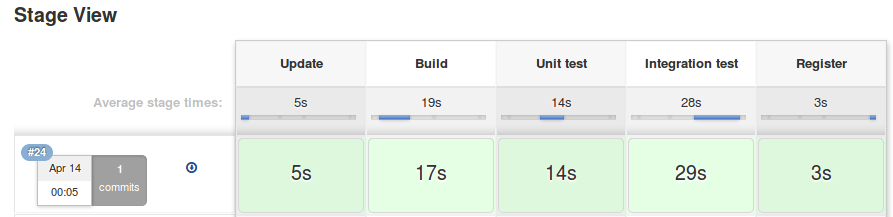

# Pipeline

Creating [docker image with an application](https://github.com/rachelcarmena/ci-cd-spring-boot-code/blob/master/Dockerfile) and pushing it to ECR:

It's based on repository [ci-cd-spring-boot-code](https://github.com/rachelcarmena/ci-cd-spring-boot-code).

Previous repository includes [_Jenkinsfile_](https://github.com/rachelcarmena/ci-cd-spring-boot-code/blob/master/Jenkinsfile).

[Jenkins job](jenkins/job/) only uses that file.
